# MundoVR: Scope of Work - MBSE & SysML-Based Systems Engineering

**Document Version:** 2.0  
**Date:** November 19, 2025  
**Methodology:** Model-Based Systems Engineering (MBSE) with SysML 2.0  
**Project:** MundoVR: A Hybrid AI-VR Architecture for Real-Time Gamified Second Language Acquisition  
**Authors:** Ashley NAKA, Jennifer AWOUNOU, Azamkhon Khudoyberdiev

---

## Executive Summary

This document defines the scope of work for the MundoVR system using **Model-Based Systems Engineering (MBSE)** principles and **Systems Modeling Language (SysML 2.0)** as the primary systems engineering methodology. Rather than traditional document-based engineering, this project employs MBSE to create a formal, integrated system model that serves as the single source of truth for requirements, architecture, design decisions, and verification.

The scope encompasses the design, specification, implementation, and evaluation of a hybrid AI-VR architecture that balances sub-1.5-second conversational latency, adaptive pedagogical content delivery, and cost-efficient scalability for real-time gamified second language learning in immersive VR environments.

**MBSE Approach:** All systems engineering artifacts (requirements, architecture, design decisions, and verification) are captured in a unified SysML model, enabling automated traceability, consistency checking, impact analysis, and stakeholder communication through multiple interconnected viewpoints.

---

## MBSE Methodology Framework

### MBSE Definition & Core Principles

**Model-Based Systems Engineering (MBSE)** is a formalized application of modeling to support system requirements, design, analysis, verification, and validation activities beginning in the concept phase and continuing through development and later life-cycle phases (IEEE/EIA 632, ISO/IEC/IEEE 42010).

**Core MBSE Principles Applied to MundoVR:**

| Principle | Application | Benefit |
|---|---|---|
| **Single Source of Truth** | All requirements, architecture, design decisions in unified SysML model | Eliminates document inconsistencies, enables single-point updates |
| **Executable Specification** | SysML model constraints are machine-checkable | Automated consistency validation, early error detection |
| **Integrated Viewpoints** | Multiple SysML diagrams interconnected (requirements ↔ architecture ↔ behavior ↔ deployment) | Comprehensive system understanding, stakeholder-specific views |
| **Traceability Automation** | Bidirectional links between requirements, components, tests | Impact analysis, requirements coverage verification, change control |
| **Model Reusability** | Architecture patterns, service templates, stereotype libraries | Accelerated design cycles, consistency across projects |
| **Collaborative Engineering** | Shared SysML model accessible to all stakeholders (via tools like MagicDraw, Enterprise Architect, Cameo) | Synchronized communication, concurrent development |

### MBSE vs. Traditional Document-Based Approach

**Traditional Approach Limitations:**
- Requirements scattered across multiple documents (easily outdated)
- Architecture documentation becomes stale after implementation
- Manual traceability = errors and gaps
- Change impact analysis requires manual review of documents
- No automated consistency checking

**MBSE Advantages for MundoVR:**
- Single SysML model = definitive system description
- Automated traceability reporting (Requirements ✓ Architecture ✓ Code ✓ Tests)
- Architecture-driven requirements allocation (RQ → Service → Component)
- Change impact analysis: modify requirement → see all affected services/tests
- Stakeholder reports auto-generated from model (different views for different audiences)

---

## MBSE Methodology & Lifecycle Integration

### Methodology Phases Aligned to Systems Engineering V-Model

```mermaid
graph TD
    A["📋 Mission Analysis<br/>Define MundoVR Purpose & Context"] --> B["📊 Requirements Analysis<br/>Capture FR1-FR6, NFR1-NFR7, RQ1-RQ5"]
    B --> C["🎨 Conceptual Design<br/>Context Diagram, Use Cases, Initial IBD"]
    C --> D["🏗️ Preliminary Design<br/>Component Architecture, State/Behavior"]
    D --> E["🔧 Detailed Design<br/>Microservice Specs, Database Schemas"]
    E --> F["💻 Implementation<br/>Go Services, Unity Client, Kubernetes"]
    F --> G["✅ Testing & Verification<br/>Unit, Integration, System, Acceptance Tests"]
    G --> H["📈 Evaluation & Lessons<br/>RQ Evidence, MBSE Review, Recommendations"]
    
    H -->|Feedback| F
    G -->|Validation| E
    E -->|Architecture Review| D
    D -->|Design Review| C
    C -->|Requirements Review| B
    
    style A fill:#e1f5ff,stroke:#0277bd,stroke-width:3px,color:#000
    style B fill:#f3e5f5,stroke:#6a1b9a,stroke-width:3px,color:#000
    style C fill:#e8f5e9,stroke:#2e7d32,stroke-width:3px,color:#000
    style D fill:#fff3e0,stroke:#e65100,stroke-width:3px,color:#000
    style E fill:#fce4ec,stroke:#c2185b,stroke-width:3px,color:#000
    style F fill:#f1f8e9,stroke:#558b2f,stroke-width:3px,color:#000
    style G fill:#e0f2f1,stroke:#00695c,stroke-width:3px,color:#000
    style H fill:#ede7f6,stroke:#512da8,stroke-width:3px,color:#000
```



### MBSE Tool Integration

**Primary MBSE Tool:** MagicDraw / Enterprise Architect (or open-source Papyrus)
- Exports SysML models to XMI (XML Metadata Interchange)
- API integration with CI/CD pipeline for automated consistency checks
- Generates stakeholder reports and traceability matrices
- Version control integration (Git with XMI-aware diffing)

**Complementary Tools:**
- **Requirements Management:** SysML model + IBM DOORS (if available) / Jira
- **Architecture as Code:** Terraform/Bicep IaC templates version-controlled alongside SysML
- **API Specification:** OpenAPI 3.0 (derived from SysML service interfaces)
- **Code-to-Model Traceability:** Architecture Decision Records (ADRs) + code comments referencing SysML diagram IDs

---

## SysML 2.0 Diagram Taxonomy for MundoVR

---

## SysML 2.0 Diagram Taxonomy for MundoVR

### Diagram Hierarchy (MBSE Documentation Standard)

```mermaid
graph TB
    MundoVR["🎯 MundoVR SysML Model<br/>18 Diagrams, 9 Viewpoints"]
    
    MundoVR --> CV["📍 CONTEXT VIEWPOINT<br/>System Boundary & Stakeholders"]
    MundoVR --> RV["📋 REQUIREMENTS VIEWPOINT<br/>What must the system do?"]
    MundoVR --> AV["🏗️ ARCHITECTURE VIEWPOINT<br/>How is system structured?"]
    MundoVR --> BV["⚙️ BEHAVIOR VIEWPOINT<br/>How does system operate?"]
    MundoVR --> CCV["⚖️ CONSTRAINT VIEWPOINT<br/>Performance, Cost, Security"]
    MundoVR --> DV["📊 DATA VIEWPOINT<br/>Information Model"]
    MundoVR --> VV["✔️ VERIFICATION VIEWPOINT<br/>Testing & Validation"]
    MundoVR --> DEC["🎓 DECISION VIEWPOINT<br/>Architecture Decisions"]
    MundoVR --> IV["💻 IMPLEMENTATION VIEWPOINT<br/>Code & CI/CD"]
    
    CV --> CV1["System Context Diagram<br/>BDD: System Boundaries"]
    CV --> CV2["Use Case Diagram<br/>Stakeholder Scenarios"]
    CV --> CV3["Stakeholder Analysis<br/>5 Actor Types"]
    
    RV --> RV1["Requirement Hierarchy<br/>FR1-FR6, NFR1-NFR7<br/>RQ1-RQ5"]
    RV --> RV2["Allocation Diagram<br/>Req → Component"]
    RV --> RV3["Traceability Matrix<br/>Req ↔ Component ↔ Test"]
    
    AV --> AV1["Component BDD<br/>10 Microservices<br/>3 Data Stores"]
    AV --> AV2["Internal Block Diagram<br/>Service Interfaces<br/>45+ Connections"]
    AV --> AV3["Deployment Topology<br/>Kubernetes Nodes<br/>Container Allocation"]
    
    BV --> BV1["State Machines<br/>Conversation Flow<br/>Session States"]
    BV --> BV2["Sequence Diagrams<br/>Service Orchestration<br/>STT→Backend→TTS"]
    BV --> BV3["Activity Diagrams<br/>Dialogue Generation<br/>Cost Optimization"]
    
    CCV --> CCV1["Latency Model<br/>Parametric: p99 &lt; 1.5s<br/>Decomposed"]
    CCV --> CCV2["Resource Model<br/>Parametric: CPU/Memory<br/>Cost Constraints"]
    
    DV --> DV1["Information Model<br/>Class Diagram<br/>User, Session, Metrics"]
    DV --> DV2["Database Schema<br/>ER Diagram<br/>PostgreSQL, Redis, VectorDB"]
    
    VV --> VV1["Test Case Allocation<br/>50+ Test Cases<br/>Req Coverage"]
    
    DEC --> DEC1["8 Architecture<br/>Decision Records<br/>ADR-001 to ADR-008"]
    
    IV --> IV1["Code Structure<br/>Package Diagram<br/>Go Microservices"]
    IV --> IV2["Code-Model Traceability<br/>@requirement Tags<br/>Automated Extraction"]
    IV --> IV3["CI/CD Pipeline<br/>GitHub Actions<br/>Automated Testing"]
    
    style MundoVR fill:#fff3e0,stroke:#e65100,stroke-width:3px,color:#000
    style CV fill:#e1f5ff,stroke:#0277bd,stroke-width:2px,color:#000
    style RV fill:#f3e5f5,stroke:#6a1b9a,stroke-width:2px,color:#000
    style AV fill:#e8f5e9,stroke:#2e7d32,stroke-width:2px,color:#000
    style BV fill:#fff3e0,stroke:#e65100,stroke-width:2px,color:#000
    style CCV fill:#fce4ec,stroke:#c2185b,stroke-width:2px,color:#000
    style DV fill:#f1f8e9,stroke:#558b2f,stroke-width:2px,color:#000
    style VV fill:#e0f2f1,stroke:#00695c,stroke-width:2px,color:#000
    style DEC fill:#ede7f6,stroke:#512da8,stroke-width:2px,color:#000
    style IV fill:#fff8f0,stroke:#ad1457,stroke-width:2px,color:#000
```



**Coverage Summary:** 18 diagrams across 9 viewpoints enabling 360° system understanding


### 1.1 Primary Stakeholders

| Stakeholder | Role | Interests | Constraints |
|---|---|---|---|
| **Language Learners** | End Users | Natural dialogue practice, engaging content, performance feedback | Limited VR hardware (mobile/standalone headsets) |
| **Pedagogical Experts** | Requirements Provider | SLA-aligned content, adaptive difficulty, learning metrics | Need evidence of pedagogical effectiveness |
| **VR Platform Providers** | Deployment Partner | Performance optimization, cost efficiency | Hardware limitations, marketplace requirements |
| **Research Community** | Validation Audience | Reproducible architecture, formal specification, benchmarks | Publication standards (IEEE, ACM) |
| **Cloud Infrastructure Providers** | Service Provider | Workload optimization, cost predictability | SLA guarantees (99.9% uptime) |

### 1.2 System Operational Environment

```
External Systems:
├── Cloud LLM Services (GPT-4, Claude, Gemini)
├── Speech Recognition Services (Whisper inference)
├── Text-to-Speech Synthesis (Piper, commercial TTS APIs)
├── Cloud Infrastructure (Kubernetes, managed databases)
└── VR Headset Hardware (Meta Quest 3, HTC Vive, Apple Vision Pro)

User Interaction Environment:
├── Classroom Settings (high school language labs)
├── Professional Training Programs
└── Self-directed Learning (tourist scenarios)
```

---

## 2. System Requirements Definition (SysML Requirement Diagrams)

### 2.1 Functional Requirements (FR)

#### FR1: Speech-to-Text Processing
- **Requirement:** Real-time streaming STT with ≥90% accuracy on controlled audio
- **Allocation:** On-device Whisper base model
- **Verification Method:** Automated accuracy testing on benchmark datasets
- **Performance Target:** <200ms per audio chunk processing

#### FR2: Dialogue Generation
- **Requirement:** LLM-based dialogue generation constrained by scenario graphs
- **Allocation:** Cloud-based LLM with prompt engineering framework
- **Verification Method:** Pedagogical expert review, alignment with SLA principles
- **Pedagogical Alignment:** Output Hypothesis (pronunciation), i+1 difficulty adjustment

#### FR3: Text-to-Speech Synthesis
- **Requirement:** Natural TTS with appropriate prosody and language-specific models
- **Allocation:** Self-hosted Piper-TTS (German: thorsten-low, English: amy-low)
- **Verification Method:** Audio quality assessment, native speaker evaluation
- **Performance Target:** <1000ms for 20-word response

#### FR4: Pronunciation Analysis
- **Requirement:** Phoneme-level pronunciation detection (non-real-time feedback)
- **Allocation:** Server-side analysis using audio features + LLM classification
- **Verification Method:** Comparison against IPA-based reference phonemes
- **Output:** Feedback report for learner review

#### FR5: Scenario-Based Curriculum
- **Requirement:** Difficulty selection with scenario branching
- **Allocation:** Scenario graph engine with state management
- **Verification Method:** User testing with target personas
- **Examples:** Tourist (A1), Business (B2), Exam Prep (C1)

#### FR6: Session Persistence & Analytics
- **Requirement:** Session logging, interaction data capture, replay capability
- **Allocation:** PostgreSQL session store, Redis caching, event streaming
- **Verification Method:** Data completeness audit, log replay validation

### 2.2 Non-Functional Requirements (NFR)

#### NFR1: Latency Performance
```
Requirement Hierarchy (SysML):
├── End-to-End Conversational Latency
│   ├── Requirement: <1.5 seconds (p99 under simulated load)
│   ├── Decomposition:
│   │   ├── On-Device Processing: <200ms
│   │   │   ├── Audio Capture & Encoding: <50ms
│   │   │   └── STT Processing (Whisper): <150ms
│   │   └── Network + Cloud: <1300ms
│   │       ├── Network RTT: <200ms (typical 4G/5G)
│   │       ├── Dialogue Generation: <800ms
│   │       └── TTS Synthesis: <300ms
│   └── Verification: Load testing with simulated 100 concurrent users
```

#### NFR2: Scalability & Throughput
- **Requirement:** Support 100 concurrent simulated users during evaluation
- **Throughput Target:** 50+ conversation turns/second across system
- **Allocation:** Kubernetes horizontal pod autoscaling, database connection pooling
- **Stress Testing Criteria:** Response time degradation <20% at 1.2x peak load

#### NFR3: Hybrid Processing Distribution
- **Requirement:** ≥40% of processing on-device to demonstrate edge-cloud balance
- **Allocation Breakdown:**
  - On-Device: STT (Whisper), embeddings, scenario routing, state management
  - Cloud: LLM dialogue, pronunciation analysis, advanced NLU
- **Measurement:** CPU cycles & latency attribution analysis

#### NFR4: Graceful Degradation
- **Requirement:** System operates with network latency injection (500ms-2000ms)
- **Fallback Behaviors:**
  - High latency: Use cached responses, reduce dialogue complexity
  - Connection loss: Offline scenario mode with pre-loaded content
- **Verification:** Chaos engineering tests with network emulation

#### NFR5: Persistence & Reproducibility
- **Requirement:** Full session replay and audit trail capability
- **Data Retention:** 12-month session archives
- **Verification:** Automated replay validation on historical sessions

#### NFR6: Security & Privacy (Research Prototype Baseline)
- **Requirement:** Encrypted data in transit (TLS 1.3), at-rest encryption for PII
- **Credential Management:** Environment-based API key storage
- **Note:** Production deployment would require additional compliance (GDPR, CCPA)

#### NFR7: Cost Efficiency
- **Requirement:** Minimize cloud API costs while maintaining quality
- **Target:** <$0.50 USD per 30-minute learning session
- **Optimization:** Hybrid on-device processing, batch TTS generation, caching strategies

---

## 3. System Boundary Definition (SysML Context Diagram)

### 3.1 In-Scope Components

```
MundoVR System Boundary:
├── VR Client Application
│   ├── VR UI Layer (Unity 3D, OpenXR)
│   ├── On-Device AI SDK
│   │   ├── Whisper STT inference
│   │   ├── Embedding model
│   │   └── Scenario graph execution
│   └── Network Communication Module
│
├── Backend Microservices Architecture
│   ├── API Gateway (Authentication, rate limiting, routing)
│   ├── Conversation Service
│   ├── STT Orchestration Service
│   ├── TTS Generation Service
│   ├── Pronunciation Analysis Service
│   ├── User Management Service
│   ├── Session Management Service
│   ├── Analytics Service
│   └── Scenario/Curriculum Service
│
├── Data Layer
│   ├── PostgreSQL (user profiles, sessions, learning data)
│   ├── Redis (caching, session state, pub/sub)
│   └── Vector Database (embeddings, semantic search)
│
├── Infrastructure
│   ├── Kubernetes Orchestration
│   ├── Container Registry (Docker images)
│   ├── Monitoring & Logging Stack
│   └── CI/CD Pipeline

└── Integration Points (External Services)
    ├── Cloud LLM APIs (OpenAI, Anthropic, Google)
    ├── Speech Model Services (Whisper inference endpoints)
    ├── TTS Backends (Piper self-hosted, Azure Cognitive Services)
    └── Infrastructure Providers (Kubernetes cluster, managed databases)
```

### 3.2 Out-of-Scope Items

| Item | Reason | Future Consideration |
|---|---|---|
| Mobile app (Android/iOS) | Native VR focus | Planned for Phase 2 |
| Advanced biometric integration | Out of prototype scope | Production roadmap |
| Multi-language support (>6 languages) | Scope limitation | Extensible framework |
| Real user deployment & SLA compliance | Research prototype | Production deployment |
| GDPR/data residency enforcement | Research baseline | Mandatory for production |
| Enterprise authentication (SSO, LDAP) | Exceeds prototype needs | Integration layer ready |

---

## 4. Work Breakdown Structure (SysML Requirement Allocation)

### 4.1 WBS Hierarchy

```
MundoVR Project
├── 1.0 Requirements & Specification (Month 1)
│   ├── 1.1 Stakeholder Analysis & Documentation
│   ├── 1.2 SysML Model Development (Context, Requirement, Block diagrams)
│   ├── 1.3 Architecture Decision Records (ADRs)
│   ├── 1.4 Data Model & Schema Design
│   └── 1.5 Performance SLA Baseline Definition
│
├── 2.0 System Architecture & Design (Month 1-2)
│   ├── 2.1 Microservice Decomposition
│   ├── 2.2 API Specification (OpenAPI/Swagger)
│   ├── 2.3 Data Flow Diagrams
│   ├── 2.4 Deployment Architecture (K8s manifests, Terraform/Bicep)
│   └── 2.5 Security Architecture & Threat Modeling
│
├── 3.0 Backend Implementation (Month 2-4)
│   ├── 3.1 API Gateway Implementation
│   ├── 3.2 Conversation Service (LLM integration)
│   ├── 3.3 STT Orchestration Service
│   ├── 3.4 TTS Generation Service
│   ├── 3.5 Pronunciation Analysis Service
│   ├── 3.6 User & Session Management
│   ├── 3.7 Analytics & Logging Pipeline
│   └── 3.8 Database & Cache Layer Setup
│
├── 4.0 VR Client Implementation (Month 2-4)
│   ├── 4.1 On-Device AI SDK Integration
│   ├── 4.2 Whisper STT Integration
│   ├── 4.3 Network Communication Module
│   ├── 4.4 VR UI/UX Implementation
│   ├── 4.5 Scenario Graph Engine
│   └── 4.6 Session Persistence Module
│
├── 5.0 Infrastructure & Deployment (Month 3-4)
│   ├── 5.1 Kubernetes Cluster Setup
│   ├── 5.2 CI/CD Pipeline Configuration
│   ├── 5.3 Monitoring & Observability Stack
│   ├── 5.4 Docker Image Preparation
│   └── 5.5 Environment Configuration (Dev, Staging, Prod)
│
├── 6.0 Integration & Testing (Month 4-5)
│   ├── 6.1 Unit Testing (Backend services)
│   ├── 6.2 Integration Testing (Service-to-service)
│   ├── 6.3 End-to-End Testing (VR client to backend)
│   ├── 6.4 Load Testing & Latency Profiling
│   ├── 6.5 Security Testing (OWASP Top 10 validation)
│   └── 6.6 Usability Testing (Scenario-based)
│
├── 7.0 Evaluation & Validation (Month 5-6)
│   ├── 7.1 Performance Benchmarking (RQ1)
│   ├── 7.2 Pedagogical Alignment Assessment (RQ2)
│   ├── 7.3 Latency Optimization Analysis (RQ3)
│   ├── 7.4 Cost-Benefit Analysis (RQ4)
│   ├── 7.5 Specification Methodology Validation (RQ5)
│   └── 7.6 Comparative Analysis (Baseline vs. Optimized)
│
└── 8.0 Documentation & Dissemination (Month 5-6)
    ├── 8.1 Technical Documentation (Architecture, APIs)
    ├── 8.2 Research Paper Writing
    ├── 8.3 ADR Compilation
    ├── 8.4 Open Source Repository Setup
    └── 8.5 Presentation & Conference Submission
```

### 4.2 Requirement Allocation Matrix (RACI)

| Requirement ID | Owning Service(s) | Verification Owner | Stakeholder Sign-off |
|---|---|---|---|
| FR1 - STT | VR Client SDK, STT Service | QA Engineer | Pedagogical Expert |
| FR2 - Dialogue | Conversation Service | Research Lead | Pedagogical Expert |
| FR3 - TTS | TTS Service | Audio QA | Language Specialist |
| FR4 - Pronunciation | Pronunciation Service | NLP Engineer | Pedagogical Expert |
| FR5 - Scenarios | Curriculum Service | UX Designer | Pedagogical Expert |
| FR6 - Analytics | Analytics Service | Data Engineer | Research Lead |
| NFR1 - Latency | All services (coordinated) | Performance Engineer | System Architect |
| NFR2 - Scalability | Infrastructure, Backend | DevOps Engineer | CTO |
| NFR3 - Hybrid Processing | VR Client, Backend | Systems Analyst | Research Lead |
| NFR4 - Degradation | Network Module, Services | QA Engineer | System Architect |
| NFR5 - Persistence | Session Service, Database | QA Engineer | System Architect |

---

## 5. Research Questions & Evaluation Strategy (SysML Traceability)

### 5.1 Research Question to Requirement Mapping

```
SysML Traceability Matrix:

RQ1: Microservice Decomposition & Edge-Cloud Distribution
├── Derives from: NFR1 (Latency), NFR2 (Scalability), NFR3 (Hybrid Distribution)
├── Verification Method: Load testing, latency profiling under 100 concurrent users
├── Evaluation Metrics:
│   ├── p99 Latency: <1.5 seconds
│   ├── Throughput: >50 turns/second
│   ├── On-device processing: ≥40% of compute
│   └── Cloud API cost: <$0.50/session
└── Success Criteria: All metrics met under sustained load

RQ2: AI Integration Strategy for Pedagogically-Aligned Dialogue
├── Derives from: FR2 (Dialogue), FR3 (TTS), FR4 (Pronunciation)
├── Verification Method: Expert pedagogical review, alignment scoring
├── Evaluation Metrics:
│   ├── Dialogue Quality Score: >8/10 (expert evaluation)
│   ├── SLA Alignment: Output Hypothesis + i+1 difficulty observed
│   └── User Engagement: Session completion rate >80%
└── Success Criteria: All AI services demonstrate pedagogical alignment

RQ3: VR-Backend Interface Optimization
├── Derives from: NFR1 (Latency), NFR3 (Hybrid Distribution), NFR4 (Degradation)
├── Verification Method: Network simulation, state consistency testing
├── Evaluation Metrics:
│   ├── Network RTT (over VR client): <200ms typical
│   ├── State Consistency: 100% alignment verification
│   └── Graceful Degradation: System functional with 2000ms latency injection
└── Success Criteria: Real-time interaction maintained across network conditions

RQ4: Cost-Efficiency vs. Quality Trade-offs
├── Derives from: NFR7 (Cost Efficiency), NFR1 (Latency), NFR2 (Scalability)
├── Verification Method: Cost modeling, sensitivity analysis
├── Evaluation Metrics:
│   ├── Cost per Session: <$0.50 USD
│   ├── Quality Metrics: Latency, accuracy maintained
│   └── Cost Optimization Tactics: Caching, batch processing effectiveness
└── Success Criteria: Achieve cost targets without quality degradation

RQ5: Formal Specification Methodology (SysML Effectiveness)
├── Derives from: All requirements (cross-cutting)
├── Verification Method: Specification review, traceability validation
├── Evaluation Metrics:
│   ├── Requirements Specification Completeness: 100% coverage
│   ├── Architecture Decision Quality: All critical trade-offs documented
│   └── Specification Review Cycle Time: <2 weeks per iteration
└── Success Criteria: SysML methodology enables reproducible research
```

---

## 6. Key Deliverables & Acceptance Criteria

### 6.1 Specification & Design Artifacts (Phase 1: Month 1-2)

| Deliverable | SysML/Formalism | Acceptance Criteria |
|---|---|---|
| **System Context Diagram** | SysML BDD (Block Definition Diagram) | Shows all external systems, user types, data flows |
| **Requirements Model** | SysML Requirement Diagram | All FR/NFR captured with traceability links |
| **Component Architecture** | SysML Internal Block Diagram (IBD) | Microservices decomposed, dependencies explicit |
| **Deployment Architecture** | SysML Deployment Diagram + K8s manifests | Infrastructure as Code, all services mapped |
| **Data Model** | UML Class Diagram + ERD | All entities, relationships, normalization verified |
| **ADR Documentation** | Architecture Decision Records (Markdown) | 8-10 critical decisions documented with rationale |
| **API Specification** | OpenAPI 3.0 (Swagger) | All endpoints, request/response schemas defined |

### 6.2 Implementation Artifacts (Phase 2: Month 2-4)

| Deliverable | Type | Acceptance Criteria |
|---|---|---|
| **Backend Services** | Go microservices (8-10 services) | All FR/NFR allocated services implemented |
| **VR Client SDK** | Unity/C# with AI integration | Whisper integration, on-device inference functional |
| **Infrastructure** | Kubernetes manifests + Helm charts | Production-ready deployments automated |
| **Database Schemas** | PostgreSQL + Redis setup scripts | All data models implemented, migrations tested |
| **CI/CD Pipeline** | GitHub Actions / GitLab CI | Automated build, test, deployment configured |

### 6.3 Testing & Validation Artifacts (Phase 3: Month 4-5)

| Deliverable | Type | Acceptance Criteria |
|---|---|---|
| **Unit Tests** | Go + Lua tests | >80% code coverage, all critical paths covered |
| **Integration Tests** | Service interaction tests | All cross-service dependencies verified |
| **Performance Baseline** | Latency/throughput reports | All NFR1-NFR4 metrics documented |
| **Load Testing Report** | JMeter/k6 results | 100 concurrent users, sustained performance |
| **Security Assessment** | Penetration testing, OWASP audit | Critical/high vulnerabilities: zero |

### 6.4 Evaluation & Research Artifacts (Phase 4: Month 5-6)

| Deliverable | Type | Acceptance Criteria |
|---|---|---|
| **RQ1 Evaluation** | Performance benchmark report | Microservice decomposition metrics validated |
| **RQ2 Evaluation** | Pedagogical alignment assessment | SLA principles demonstrated in dialogue |
| **RQ3 Evaluation** | Network simulation report | Latency & state consistency validated |
| **RQ4 Evaluation** | Cost-benefit analysis | Trade-offs quantified with sensitivity analysis |
| **RQ5 Evaluation** | Specification review findings | SysML methodology assessment documented |
| **Research Paper** | IEEE conference paper | All RQs addressed, contributions clearly stated |

---

## 7. Success Metrics & Key Performance Indicators (SysML Metrics)

### 7.1 Functional Verification Metrics

| Metric | Target | Measurement Method |
|---|---|---|
| STT Accuracy | ≥90% | Word Error Rate (WER) on benchmark datasets |
| Dialogue Relevance | 8+/10 | Expert pedagogical evaluation (n≥3) |
| TTS Naturalness | 7+/10 | Listening test with native speakers (n≥10) |
| Pronunciation Detection | 85%+ precision | Comparison with reference phoneme sequences |
| Scenario Completion | 80%+ users complete scenarios | Usability testing with target personas |

### 7.2 Performance Metrics (NFR Verification)

| Metric | Target | Acceptance Range | Measurement Point |
|---|---|---|---|
| **Latency (p99)** | <1.5s | <1.5s-2.0s (acceptable) | Under 100 concurrent load |
| **Latency (p50)** | <800ms | <800ms-1000ms (acceptable) | Typical conversational turn |
| **Throughput** | 50+ turns/s | 40-50 (degraded) | Sustained load test |
| **On-device Processing** | ≥40% | 35-40% (reduced efficiency) | CPU cycle attribution |
| **Cost per Session** | <$0.50 | $0.50-0.75 (acceptable) | 30-minute session average |
| **Availability** | 99.0%+ | 98.5-99% (acceptable) | Monthly uptime measurement |

### 7.3 Specification & Quality Metrics

| Metric | Target | Notes |
|---|---|---|
| **Requirements Coverage** | 100% | All FR/NFR mapped to implementations |
| **Traceability Links** | 100% | Bi-directional: Requirement ↔ Component ↔ Test |
| **Code Review Pass Rate** | ≥95% | First-pass review acceptance |
| **Test Coverage** | ≥80% | Unit + integration testing combined |
| **Documentation Completeness** | 100% | All ADRs, APIs, schemas documented |
| **Specification Review Cycle** | <2 weeks | Iteration time from review to implementation |

---

## 8. Technical Constraints & Assumptions

### 8.1 Technical Constraints

| Constraint | Impact | Mitigation |
|---|---|---|
| **VR Hardware Limitations** | On-device model size must be <500MB | Use quantized Whisper base model |
| **Network Latency (Mobile)** | 50-200ms typical, 500ms+ edge cases | Hybrid architecture, offline fallbacks |
| **Cloud API Costs** | Per-request pricing for LLM/TTS | Batch processing, caching, rate optimization |
| **Real-time Inference** | Whisper inference >500ms on older devices | Target high-end VR (Meta Quest 3, Vive XR Elite) |
| **TLS/Encryption Overhead** | Adds 5-10% to network RTT | Accept as security baseline |

### 8.2 Technical Assumptions

| Assumption | Justification | Risk |
|---|---|---|
| Cloud LLM APIs available 99.9% uptime | Industry standard SLA | Fallback to cached responses if degraded |
| Network connectivity consistent (4G/5G) | Typical deployment scenario | Offline scenario mode for resilience |
| Whisper base model sufficient for pedagogy | Literature precedent (Godwin-Jones 2024) | Monitor pedagological alignment in evaluation |
| Scenario graphs constrain dialogue quality | Reduces hallucination/off-topic responses | Validate with expert reviews |
| On-device caching effective for latency | Edge computing best practice | Profile cache hit rates in testing |

---

## 9. Project Timeline & Milestones (26-Week Roadmap)


**Phase Breakdown (26 Weeks Total):**

| Phase | Duration | Deliverables | Key Activities |
|---|---|---|---|
| **Phase 1: Requirements & Specification** | Weeks 1-4 | SysML models (3 diagrams), Specification docs, ADR drafts | Stakeholder workshops, architecture design, API specification |
| **Phase 2: Design & Setup** | Weeks 5-8 | Architecture baseline (BDD/IBD), Infrastructure code, CI/CD | Microservice design, infrastructure setup, team training |
| **Phase 3: Core Implementation** | Weeks 9-16 | Backend services (90% complete), APIs, databases | API Gateway, conversation engine, session management |
| **Phase 4: VR Client & Integration** | Weeks 17-20 | On-device AI, VR UI, end-to-end integration | Whisper integration, VR interface, integration testing |
| **Phase 5: Testing & Optimization** | Weeks 21-24 | Performance metrics, load test results, optimization reports | Unit/integration/system testing, latency optimization |
| **Phase 6: Evaluation & Publication** | Weeks 25-26 | Research findings, paper submission, final documentation | RQ evaluation, paper writing, presentation materials |

---

## 10. Risk Management (SysML Risk Diagrams)

### 10.1 Identified Risks

| Risk ID | Risk Description | Likelihood | Impact | Mitigation Strategy |
|---|---|---|---|---|
| **R1** | Latency targets unachievable with cloud LLM | Medium | High | Implement LLM caching, response templates, on-device fallbacks |
| **R2** | Cloud API costs exceed budget | Medium | Medium | Set up usage quotas, batch processing, cost monitoring dashboards |
| **R3** | Whisper on-device inference too slow on target hardware | Low | High | Pre-test on actual devices, use quantization, fallback to streaming |
| **R4** | Pedagogical efficacy not demonstrable in prototype | Low | High | Expert review early, align with SLA theory throughout design |
| **R5** | Key team member unavailability | Low | Medium | Document all decisions in ADRs, maintain knowledge repository |
| **R6** | Network connectivity issues in testing environment | Medium | Medium | Setup local infrastructure simulation, chaos engineering tests |
| **R7** | State synchronization bugs between VR & backend | Medium | High | Extensive integration testing, event sourcing for audit trail |
| **R8** | Open source library dependency vulnerabilities | Medium | Low | Automated vulnerability scanning (Snyk, Dependabot) |

### 10.2 Risk Mitigation Roadmap


---

## 11. Governance & Decision-Making (SysML Stakeholder Analysis)

### 11.1 MBSE Governance Model

**MBSE Model Governance Structure:**
MBSE Steering Committee
├─ Chief Systems Engineer (Model Owner)
│  ├─ Responsibility: SysML model integrity, consistency, completeness
│  ├─ Authority: Approve all model changes impacting architecture/requirements
│  └─ Tools: MagicDraw/Enterprise Architect admin access
│
├─ Requirements Manager (SysML Requirements Module Owner)
│  ├─ Responsibility: Requirement hierarchy, traceability, allocation
│  ├─ Authority: Approve requirement changes, allocation updates
│  └─ Tasks: Maintain FR/NFR hierarchy, RQ linkage
│
├─ Architecture Manager (SysML Architecture Module Owner)
│  ├─ Responsibility: Component BDD/IBD, deployment diagrams
│  ├─ Authority: Architecture decisions, ADRs, service decomposition
│  └─ Tasks: Maintain architectural consistency, interface specifications
│
├─ Test Manager (Verification Module Owner)
│  ├─ Responsibility: Test case traceability to requirements
│  ├─ Authority: Verification/validation strategy
│  └─ Tasks: Map tests to SysML requirements, track coverage
│
└─ DevOps Engineer (Deployment Module Owner)
   ├─ Responsibility: Deployment diagrams, infrastructure as code
   ├─ Authority: Kubernetes manifests, Terraform configurations
   └─ Tasks: Keep K8s/IaC synchronized with SysML deployment model
```

### 11.2 MBSE Model Change Control

**SysML Model Change Request (MCRF) Workflow:**

```
1. Identify Change → 2. Submit MCRF → 3. Impact Analysis → 4. Review → 5. Approve → 6. Implement → 7. Verify
                                              ↓
                       Query SysML Model:
                       - Affected requirements
                       - Dependent components
                       - Traceability chains
                       - Related tests
                       
               Automated by MBSE Tools!
```

**Change Categories:**

| Category | Scope | Approval | Impact Analysis |
|---|---|---|---|
| **Trace Link Update** | Requirement ↔ Component link | Architect | Automated traceability report |
| **Requirement Modification** | FR/NFR change, new allocation | Requirements Manager + Architect | Affected services, tests identified |
| **Architecture Update** | Component change, new service | Architecture Manager | All dependent services, deployment impact |
| **Constraint Adjustment** | Latency/cost/throughput target | Steering Committee | Feasibility study required |
| **Verification Update** | Test case change, acceptance criteria | Test Manager | Coverage impact analysis |

### 11.3 MBSE Reporting & Metrics

**Automated SysML Model Reports (Generated from Model, Not Manual Documents):**

```
MundoVR MBSE Reporting Suite:
├─ Requirements Traceability Matrix (RTM)
│  └─ Auto-generated: Shows Requirement → Component → Code → Test mapping (100% coverage?)
├─ Architecture Consistency Report
│  └─ Checks: All BDD blocks have corresponding IBD interactions, all interfaces specified
├─ Requirement Coverage Report
│  └─ Shows: Which FR/NFR are allocated to which services, unallocated requirements detected
├─ Change Impact Analysis Report
│  └─ When requirement modified: Show all affected components, tests, design decisions
├─ Traceability Gap Report
│  └─ Identifies: Orphaned requirements, untested components, missing allocations
└─ Compliance Checklist
   └─ Verify: All RQs addressed in SysML, all ADRs documented, 100% code-to-model links
```

### 11.4 MBSE Review Gates

| Gate | Trigger | SysML Model Validation | Approval | Frequency |
|---|---|---|---|---|
| **Specification Review** | Requirements finalized | Requirements diagram 100% complete, all FR/NFR allocated | Requirements Manager + Research Lead | Week 4 |
| **Architecture Baseline** | Design phase end | BDD/IBD complete, all interfaces specified, adrs documented | Architecture Manager + CTO | Week 8 |
| **Implementation Readiness** | Dev phase start | Component interfaces frozen, test cases defined, deployment diagram done | Chief Systems Engineer | Week 9 |
| **Integration Verification** | Testing phase | All test cases linked to requirements in SysML, coverage ≥80% | Test Manager | Week 22 |
| **Final Model Audit** | Pre-delivery | Model consistency check (no orphaned elements), traceability 100% | SysML Lead + Research Lead | Week 26 |

---

## Change Control Process

```
Change Request → Requirements Update → SysML Model Update → 
Architecture Review → Implementation Plan → Verification Plan → 
Approval → Deployment → Verification Report
```

**Change Control Thresholds (MBSE-Aware):**
- **Minor:** Cosmetic SysML updates, documentation-only changes (Single approver)
- **Medium:** Feature modifications affecting <3 services (Technical lead + 1 reviewer, impact analysis required)
- **Major:** Architecture changes, new services, requirement modifications (Full steering committee, SysML model consistency review)

### 11.2 Quality Gates & Reviews

| Gate | Responsible | Criteria | Frequency |
|---|---|---|---|
| **Requirements Review** | Research Lead + Pedagogical Expert | All FR/NFR defined, traced to RQs | Start of Phase 1 |
| **Architecture Review** | System Architect + Security Lead | All ADRs documented, no critical gaps | End of Phase 1 |
| **Code Review** | Technical Lead (peer review) | Coverage >80%, SLA compliance verified | Per merge request |
| **Performance Gate** | Performance Engineer | NFR1-NFR7 baselines achieved | End of Phase 3 |
| **Security Review** | Security Expert | OWASP Top 10 audit passed | End of Phase 5 |
| **Evaluation Review** | Research Committee | All 5 RQs addressed with evidence | End of Phase 6 |

---

## 12. Communication & Reporting Plan (SysML Viewpoint Structure)

### 12.1 Stakeholder Communication

| Stakeholder | Communication | Frequency | Format |
|---|---|---|---|
| **Steering Committee** | Project status, risk updates, decisions | Bi-weekly | Formal meeting + slides |
| **Development Team** | Technical specs, blockers, decisions | Daily standup | 15-min sync |
| **Pedagogical Experts** | Requirements review, design feedback | Weekly | Technical walkthrough |
| **Research Community** | Progress updates, methodology insights | Monthly | Preprint server, blog posts |

### 12.2 Reporting Structure

```
SysML Documentation Repository:
├── Requirements Model (XML/JSON export from SysML tool)
├── Architecture Viewpoint (diagrams + ADRs)
├── Implementation Traceability (Requirement → Code mapping)
├── Testing & Verification Reports
├── Evaluation Findings (RQ-specific reports)
└── Lessons Learned & Process Improvements

Monthly Stakeholder Reports:
├── Executive Summary (1 page: status, risks, next steps)
├── Technical Status (Architecture compliance, open issues)
├── Research Progress (RQ advancement, preliminary findings)
└── Resource Utilization (Budget, schedule variance)
```

---

## 13. Success Criteria Summary

### 13.1 Project Success Criteria (SysML Verification Plan)

**All of the following must be achieved for project success:**

1. ✅ **Specification Completeness** 
   - All FR (6) and NFR (7) requirements specified and allocated
   - 100% traceability between requirements and implementations
   - All 5 RQs explicitly addressed in specification

2. ✅ **Performance Achievement**
   - p99 latency <1.5 seconds (under 100 concurrent load)
   - Throughput ≥50 conversation turns/second
   - On-device processing ≥40% of compute cycles
   - Cost <$0.50 per 30-minute session

3. ✅ **Functional Verification**
   - All FR (1-6) pass acceptance testing
   - STT accuracy ≥90%, Dialogue quality ≥8/10, TTS naturalness ≥7/10
   - Pronunciation analysis functional, Scenario completion >80%
   - Session persistence & replay fully operational

4. ✅ **Research Contribution**
   - All 5 RQs answered with quantitative + qualitative evidence
   - Hybrid architecture pattern validated and documented
   - SysML specification methodology reviewed and assessed
   - Publishable results (IEEE/ACM quality)

5. ✅ **Architecture & Design Quality**
   - 8-10 critical ADRs documented with explicit trade-offs
   - Security baseline (TLS, encryption) implemented
   - Graceful degradation under network stress verified
   - Cost-benefit analysis quantified

6. ✅ **Documentation & Reproducibility**
   - Complete SysML model (requirements, architecture, component, deployment)
   - Open-source repository (GitHub) with reproducible build/test/deploy
   - Research paper submitted to IEEE/ACM venue
   - All artifacts publicly available for peer review

---

## Appendix B: MBSE Implementation Roadmap for MundoVR

### MBSE Tool Infrastructure Setup (Week 1-2)

**Primary MBSE Tool Selection & Configuration:**

```
Tool: Enterprise Architect (Sparx Systems) or MagicDraw (Dassault Systems)
├─ Installation & License Management
│  ├─ Seats: 8-10 (team members)
│  ├─ Repository: Shared model server (PostgreSQL backend)
│  └─ Version Control: Git integration for model exports (XMI/HTML)
│
├─ Model Structure Setup
│  ├─ Create Package Hierarchy (matching SysML diagram taxonomy)
│  │  ├─ Requirements Package (FR, NFR, RQ allocations)
│  │  ├─ Architecture Package (BDD, IBD, Deployment)
│  │  ├─ Behavior Package (State, Sequence, Activity diagrams)
│  │  ├─ Data Package (Information model, ER diagram)
│  │  └─ Verification Package (Test case allocations)
│  │
│  ├─ Define Stereotypes & Profiles
│  │  ├─ «Requirement» stereotype with fields: ID, Priority, Allocation, Verification Method
│  │  ├─ «Component» stereotype with fields: Service Type, Interface, Port definitions
│  │  ├─ «Constraint» stereotype with fields: Type (latency/cost/throughput), Value, Unit
│  │  └─ «ADR» stereotype with fields: Decision ID, Rationale, Alternatives, Status
│  │
│  └─ Establish Traceability Links
│     ├─ Refine relationships (Requirement → satisfiedBy → Component)
│     ├─ Verify relationships (Requirement → verifiedBy → TestCase)
│     └─ Allocate relationships (RQ → decomposedInto → FR/NFR)
│
└─ Automation & CI/CD Integration
   ├─ Export Model to Multiple Formats
   │  ├─ XMI (XML Metadata Interchange) for version control
   │  ├─ HTML Reports (stakeholder-readable traceability matrices)
   │  └─ JSON/YAML (for downstream tooling integration)
   │
   ├─ Consistency Validation Scripts
   │  ├─ Check: All requirements allocated to ≥1 component
   │  ├─ Check: All components satisfy ≥1 requirement
   │  ├─ Check: All test cases linked to ≥1 requirement
   │  └─ Check: No orphaned model elements
   │
   └─ GitHub Actions Workflow
      ├─ Trigger: Model update commit
      ├─ Steps: XMI export → Validation checks → Generate reports → Commit artifacts
      └─ Outputs: Traceability matrix, Gap report, Consistency audit
```

### MBSE Model Population Timeline

```
Week 1-2: Tool Setup
  └─ Tool installation, repository configuration, team training

Week 3-4: Requirements Capture (MBSE Phase 1)
  ├─ Create Requirement hierarchy (FR1-FR6, NFR1-NFR7)
  ├─ Allocate requirements to Research Questions (RQ1-RQ5)
  ├─ Define acceptance criteria for each requirement
  ├─ Setup traceability relationships to stakeholders
  └─ Output: Requirements Diagram + RTM (100% completeness)

Week 5-6: Architecture Specification (MBSE Phase 2)
  ├─ Create System Context Diagram (BDD)
  ├─ Design Microservice architecture (BDD blocks for 8-10 services)
  ├─ Specify service interfaces (ports, connectors, operations)
  ├─ Map requirements to components (allocation relationships)
  ├─ Document Architecture Decision Records (10+ ADRs in SysML)
  └─ Output: Architecture Diagrams + Interface Specifications

Week 7-8: Behavior & Constraints (MBSE Phase 3)
  ├─ Create State Machine diagrams (conversation flow, session lifecycle)
  ├─ Create Sequence diagrams (STT-to-response workflow)
  ├─ Define Parametric constraints (latency formula, cost model)
  ├─ Allocate constraints to components
  └─ Output: Behavior Models + Constraint Specifications

Week 9: Verification Strategy (MBSE Phase 4)
  ├─ Create Test Case blocks in SysML (unit, integration, system)
  ├─ Link each test case to requirements (verifies relationship)
  ├─ Calculate coverage metrics (FR/NFR → Test mapping)
  ├─ Create Verification Plan diagram
  └─ Output: Test Traceability Matrix + Coverage Report

Week 10-26: Model Maintenance
  ├─ Update model with implementation insights (continuous refinement)
  ├─ Track design changes via Model Change Requests (MCRFs)
  ├─ Generate impact analysis reports automatically
  ├─ Maintain bi-directional traceability (code ↔ model)
  └─ Generate stakeholder reports (weekly/monthly)
```

### MBSE-Driven Code Generation & Traceability

**Bridging SysML Model to Implementation (Code-Level Traceability):**

```
SysML Model Layer:
├─ Requirement: "FR1: STT with ≥90% accuracy"
│  └─ [satisfiedBy] → Component: "STT Service"
│      └─ Interface: "ProcessAudioInput(audio: Audio): TranscriptionResult"
│
Implementation Layer (Go Backend):
├─ File: backend/services/stt_service/service.go
│  ├─ Package: speechtotext
│  ├─ Type: STTService
│  ├─ Method: ProcessAudioInput(audio []byte) (*TranscriptionResult, error)
│  │
│  └─ Code Comment (SysML Traceability):
│     // @requirement FR1: Real-time streaming STT with ≥90% accuracy
│     // @component STT Service (SysML BDD block ID: STT_Service_001)
│     // @interface ProcessAudioInput (SysML IBD connector ID: IF_STT_Audio)
│     // @test TestSTTAccuracy_90Percent (maps to SysML test case TC_FR1_001)
│     func (s *STTService) ProcessAudioInput(audio []byte) (*TranscriptionResult, error) {
│         // Implementation...
│     }
│
Testing Layer:
├─ File: backend/services/stt_service/service_test.go
│  ├─ Test: TestSTTAccuracy_90Percent
│  │  └─ Code Comment:
│     // @requirement FR1
│     // @sysml-testcase TC_FR1_001
│     func TestSTTAccuracy_90Percent(t *testing.T) {
│         // Test implementation verifies FR1 acceptance criteria
│     }
│
MBSE Traceability Automation:
├─ Extract code comments (@ tags) via regex
├─ Cross-reference with SysML model (IDs, requirement codes)
├─ Generate bidirectional links (Code → SysML)
├─ Validate: Every component in SysML has ≥1 implementing code
├─ Report gaps: Components without code, code without requirements
└─ Output: Code-Model Traceability Report (auto-generated, committed to repo)
```

### MBSE Stakeholder Report Examples

**Weekly Steering Committee Report (Auto-Generated from SysML Model):**

```markdown
# MundoVR Status Report - Week 12
Generated from: MundoVR SysML Model v2.3.1

## Requirement Status
- Functional Requirements: 6/6 allocated to components (100%)
- Non-Functional Requirements: 7/7 constraints defined (100%)
- Research Questions: 5/5 mapped to FR/NFR (100%)

## Architecture Progress
- Services designed: 10/10 (100%)
- Interfaces specified: 45/45 (100%)
- ADRs documented: 8/10 (80% - 2 pending final review)

## Traceability Metrics
- Requirements → Components: 100% (13 → 28 allocations)
- Components → Test Cases: 92% (26/28 components have tests)
- Gap: Pronunciation Service missing test allocation (MCRF pending)

## Change Impact
- This week's changes: 3 minor, 1 medium MCRFs approved
- Medium change: Modified FR5 (Scenario difficulty) 
  - Affected: Curriculum Service (architecture updated), 2 test cases (modified)
  - Risk: None (impact analysis completed)

## Next Week
- Complete 2 pending ADRs
- Finalize Pronunciation Service test allocation
- Architecture baseline review scheduled
```

**Monthly Research Progress Report (SysML-Derived):**

```
# RQ Progress Summary (from SysML Model)

## RQ1: Microservice Decomposition & Edge-Cloud Distribution
Status: ON TRACK (75% complete)
- Metrics to track: Latency p99, Throughput (turns/sec), On-device % processing
- Components allocated: API Gateway, STT Service, Conversation Service, TTS Service
  All services defined in SysML BDD with performance constraints
- Verification: Load testing design captured in SysML verification diagram
- Evidence collection: Latency parametric constraints specified in model

## RQ2: AI Integration for Pedagogically-Aligned Dialogue
Status: ON TRACK (70% complete)
- Requirements: FR2 (Dialogue), FR3 (TTS), FR4 (Pronunciation) allocated
- Pedagogical alignment captured as NFR constraint (SLA principles enforcement)
- Expert review: Pedagogical Expert role in SysML model, assigned to review test cases
- Next: Add design patterns for Interaction Hypothesis (conversation focus)

## RQ3: VR-Backend Interface Optimization
Status: REVIEW (Needs latency optimization)
- Sequence diagram: VR Client ↔ API Gateway ↔ Backend services captured
- Latency constraint: End-to-end <1.5s, broken down per service
- Network degradation scenarios: Captured in state machine (graceful degradation)
- Risk: Whisper on-device inference may exceed 150ms target (noted in SysML constraint)

## RQ4: Cost-Efficiency Trade-offs
Status: IN PROGRESS (60% complete)
- Cost model: Parametric diagram with LLM API cost, on-device savings
- Caching strategy: Redis allocation captured in architecture
- Optimization: Batch TTS generation designed (component spec complete)
- Still needed: Run cost-benefit sensitivity analysis in evaluation phase

## RQ5: Formal Specification Methodology (SysML Effectiveness)
Status: VALIDATION PHASE (90% complete)
- SysML model completeness: 95% (model coverage metrics in SysML tool)
- Traceability: 100% for FR/NFR, 90% for components (Pronunciation Service gap noted)
- ADR documentation: 80% (8/10 critical decisions documented)
- Methodology assessment: Scheduled for final evaluation (Week 26)
```

---

## Appendix C: SysML Modeling Conventions

### 14.1 Diagram Types Used in This Scope

| Diagram Type | Purpose | Key Elements |
|---|---|---|
| **Context Diagram (BDD)** | System boundary definition | System block, external systems, actors |
| **Requirement Diagram** | Requirements specification | Requirement blocks, satisfaction relationships |
| **Block Definition Diagram (BDD)** | Component decomposition | Block hierarchies, interfaces, ports |
| **Internal Block Diagram (IBD)** | Component interactions | Connectors, flow, data passing |
| **Sequence Diagram** | Interaction flows | Lifelines, messages, time ordering |
| **State Machine Diagram** | System behavior | States, transitions, events |
| **Deployment Diagram** | Infrastructure mapping | Nodes, artifacts, deployment relationships |

### 14.2 Traceability Strategy (ISO/IEC/IEEE 42010)

```
Stakeholder Needs → Requirements → Architecture → Components → Code → Tests
     ↓                   ↓              ↓              ↓         ↓       ↓
  User Personas   FR/NFR Specs      ADRs           Services  Functions  Cases
  
Backward Traceability: Every requirement must be satisfied by ≥1 component
Forward Traceability: Every component must implement ≥1 requirement
```

---

## 15. Appendix B: Reference Documents

### Internal References
- **TERMINOLOGY_GUIDE.md** - Project terminology and definitions
- **Comprehensive_Requirements.md** - Detailed requirements baseline
- **backend-architecture.md** - Current backend design
- **microservices-specification.md** - Service specifications
- **PHASE_8_TECHNICAL_REFERENCE.md** - Previous phase documentation

### External References
- **ISO/IEC/IEEE 42010** - Recommended practice for architectural description
- **SysML v2.0 Specification** - OMG Systems Modeling Language
- **OpenAPI 3.0** - REST API specification standard
- **Kubernetes Best Practices** - CNCF documentation

### Literature References (per index_acm.tex)
- Zhu et al. (2025) - LLM-powered adaptive agents
- Godwin-Jones (2024) - Edge-cloud AI for education
- Schorr et al. (2024) - VR effectiveness for language learning
- Vallance (2024) - AI-enabled NPC design in immersive environments

---

## Appendix D: MBSE Benefits & Success Metrics for MundoVR

### MBSE-Specific Success Criteria

**Beyond Traditional Project Success, MBSE Enables:**

| MBSE Benefit | MundoVR Implementation | Measurement |
|---|---|---|
| **Automated Traceability** | Every requirement linked to component, code, test | RTM 100% complete, zero orphaned requirements |
| **Impact Analysis Automation** | Change to requirement auto-shows affected services, tests | MCRF analysis <1 hour vs. 8 hours manual |
| **Consistency Checking** | SysML model validated for architectural compliance | Daily consistency audit reports, 0 critical gaps |
| **Stakeholder Communication** | Auto-generate reports for different audiences | Weekly auto-reports replacing manual status updates |
| **Knowledge Preservation** | All design decisions documented in model, not scattered docs | ADRs + model rationale searchable, 100% accessible |
| **Scalability for Future Phases** | Architecture patterns reusable, extending model faster | Phase 2 design time reduced by 40% vs. traditional |
| **Verification Completeness** | Tests explicitly mapped to requirements in model | Test coverage metrics auto-calculated from SysML |
| **Design Quality** | Contradictions between requirements caught early | Conflict detection: catches incompatible NFRs during modeling |

### MBSE Metrics & KPIs

**Track MBSE Process Health (Alongside Technical Metrics):**

| Metric | Target | Measurement Point |
|---|---|---|
| **Model Completeness** | 100% | All FR/NFR in SysML, all components allocated, all tests traced |
| **Traceability Coverage** | 100% | Bi-directional: Req ↔ Component ↔ Code ↔ Test (weekly audit) |
| **Architecture Consistency** | 0 critical gaps | Daily SysML model validation (automated checks) |
| **Model Review Cycle** | <2 weeks | From MCRF submission to approval (tracked in model tool) |
| **Stakeholder Report Generation** | 100% automated | No manual status documents; all from SysML model |
| **Design Decision Capture** | 10/10 ADRs | All critical decisions documented in SysML |
| **Impact Analysis Accuracy** | 95%+ | Verify MCRF analysis matches actual code changes |
| **Knowledge Retention** | 100% accessible | All design rationale searchable in SysML model |

### MBSE ROI for Academic Research

**Why MBSE Matters for Publication:**

Traditional research:
- Architecture described in paper (2D diagrams)
- Requirements scattered across documents
- Design decisions explained in text
- Readers cannot fully understand system structure
- Reproduction difficult (ambiguous specifications)

MBSE research contribution:
- Formal SysML model published (downloadable from GitHub)
- Executable specification (loadable in EA/MagicDraw)
- All design rationales embedded in model
- Reproducibility enhanced (model is precise, executable)
- Research Impact amplified (system complexity documented & extendable)

---

## Appendix E: MBSE Tools & Technology Stack

### Recommended MBSE Tool Comparison

| Aspect | Enterprise Architect | MagicDraw | Papyrus (Open-Source) |
|---|---|---|---|
| **Cost** | $2,000-5,000/seat | $3,000-8,000/seat | Free |
| **Learning Curve** | Moderate | Steep | Steep |
| **Model Server** | PostgreSQL backend | Proprietary | Git-based |
| **Git Integration** | XMI diff support | Limited | Native Git |
| **SysML 2.0** | Partial | Full | Partial |
| **Team Collaboration** | Excellent | Excellent | Good |
| **Report Generation** | Automated | Extensive | Manual |
| **Recommendation** | ✓ Recommended for MundoVR | Excellent if budget allows | Consider if budget-constrained |

### Integration with Development Stack

```
MBSE Tool Integration Architecture:

SysML Model (Enterprise Architect)
    ↓ (XMI Export via API)
├─ GitHub Repository (Version Control)
│  └─ Commit: model_v2.3.xmi + reports/ + code_traceability.json
│
├─ CI/CD Pipeline (GitHub Actions)
│  ├─ Step 1: Validate XMI schema
│  ├─ Step 2: Run consistency checks (SysML validation rules)
│  ├─ Step 3: Extract code-model links (grep @requirement tags)
│  ├─ Step 4: Generate traceability matrix
│  └─ Step 5: Publish reports to GitHub Pages
│
├─ Code Repository (Go Backend + Unity VR)
│  ├─ services/*/service.go → @requirement & @component tags
│  ├─ services/*/service_test.go → @sysml-testcase tags
│  └─ scripts/traceability_extractor.py → Parse tags, cross-ref SysML
│
└─ Documentation (Markdown + Auto-Generated)
   ├─ ARCHITECTURE.md (hand-written + SysML export)
   ├─ TRACEABILITY_MATRIX.md (auto-generated from SysML)
   ├─ API_SPEC.md (derived from SysML interface definitions)
   └─ VERIFICATION_PLAN.md (auto-generated from SysML)
```

### Model Repository Structure

```
MundoVR-MBSE/
├─ MundoVR_SystemModel.eap (Enterprise Architect project)
├─ exports/
│  ├─ Requirements_Diagram.png
│  ├─ Architecture_BDD.png
│  ├─ Deployment_Diagram.png
│  ├─ Traceability_Matrix.xlsx (weekly export)
│  ├─ ADRs_from_Model.md (auto-exported)
│  └─ Consistency_Audit_Report.html (daily)
├─ scripts/
│  ├─ validate_model_consistency.py
│  ├─ export_traceability_matrix.py
│  ├─ extract_code_traceability.py
│  └─ generate_stakeholder_reports.py
└─ README.md (MBSE setup & usage guide)
```

---

## Document History

| Version | Date | Author | Changes |
|---|---|---|---|
| 1.0 | Nov 19, 2025 | Azamkhon K. | Initial SysML-based structure |
| 2.0 | Nov 19, 2025 | Azamkhon K. | Comprehensive MBSE integration, governance, tooling roadmap |

---

**Status:** APPROVED FOR IMPLEMENTATION  
**Next Review Date:** December 3, 2025 (End of Phase 1)  
**Document Owner:** Research Team (MundoVR Project)

