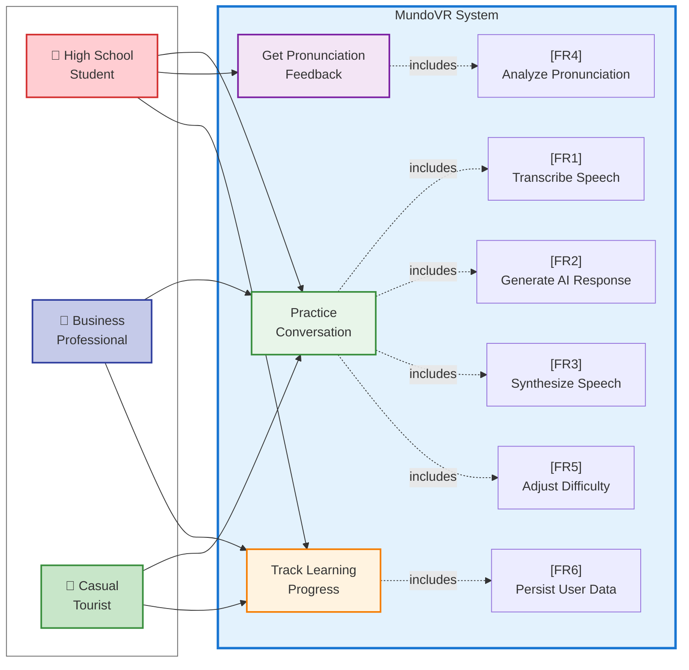
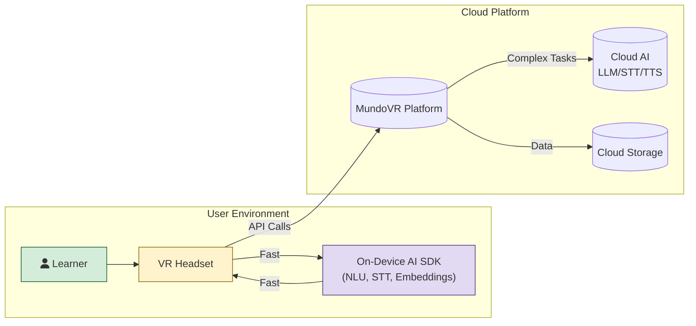
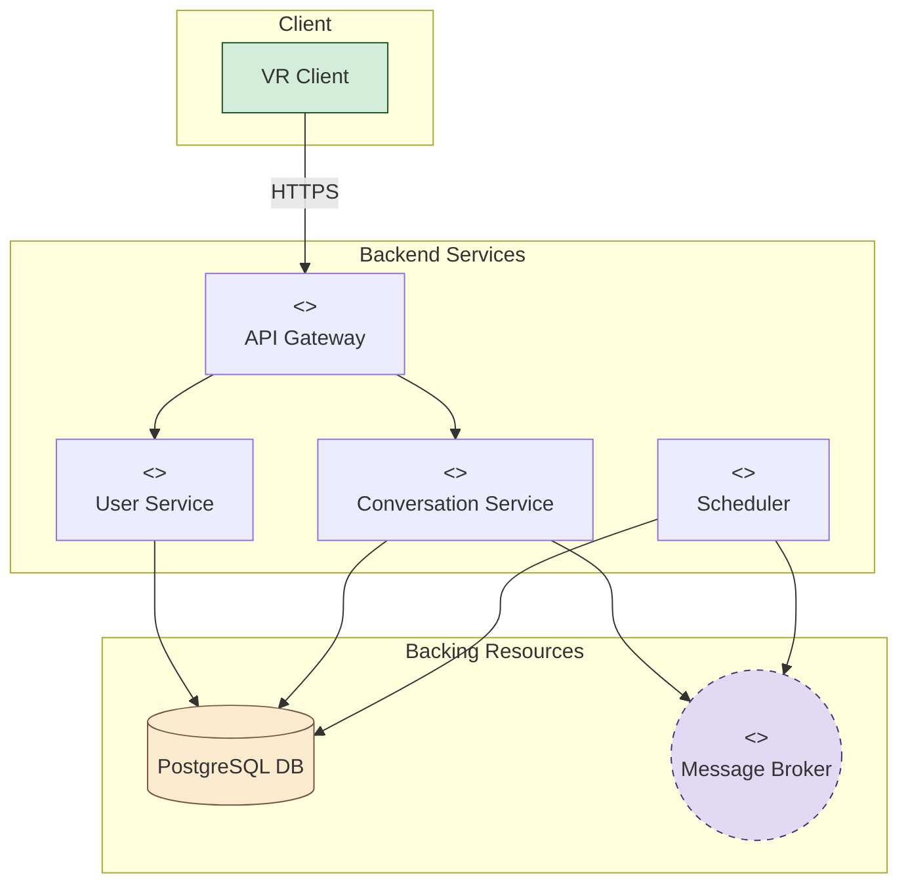
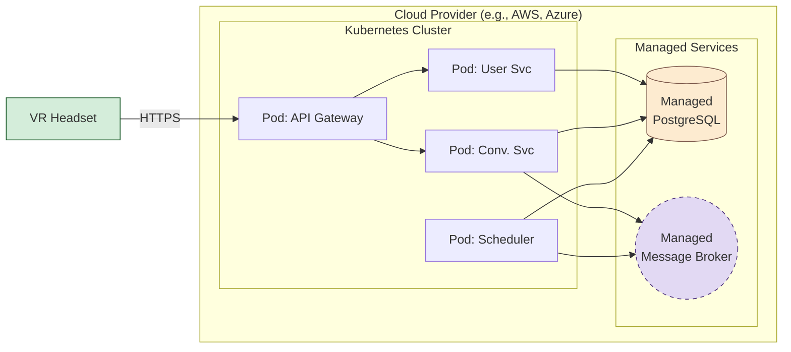

# Diagrams

## Use Case Diagram

```mermaid
graph LR
    subgraph Actors[" "]
        direction TB
        student["👤 High School<br>Student"]
        professional["👤 Business<br>Professional"]
        tourist["👤 Casual<br>Tourist"]
    end
    
    subgraph System["MundoVR System"]
        direction TB
        
        practice["Practice<br>Conversation"]
        pronunciation["Get Pronunciation<br>Feedback"]
        track["Track Learning<br>Progress"]
        
        practice -.includes.-> FR1["[FR1]<br>Transcribe Speech"]
        practice -.includes.-> FR2["[FR2]<br>Generate AI Response"]
        practice -.includes.-> FR3["[FR3]<br>Synthesize Speech"]
        practice -.includes.-> FR5["[FR5]<br>Adjust Difficulty"]
        
        pronunciation -.includes.-> FR4["[FR4]<br>Analyze Pronunciation"]
        
        track -.includes.-> FR6["[FR6]<br>Persist User Data"]
    end
    
    %% User interactions - only high-level use cases
    student --> practice
    student --> pronunciation
    student --> track
    
    professional --> practice
    professional --> track
    
    tourist --> practice
    tourist --> track
    
    style System fill:#e3f2fd,stroke:#1976d2,stroke-width:3px
    style Actors fill:#fff,stroke:#666,stroke-width:1px
    
    style student fill:#ffcdd2,stroke:#d32f2f,stroke-width:2px
    style professional fill:#c5cae9,stroke:#303f9f,stroke-width:2px
    style tourist fill:#c8e6c9,stroke:#388e3c,stroke-width:2px
    
    style practice fill:#e8f5e9,stroke:#388e3c,stroke-width:2px
    style pronunciation fill:#f3e5f5,stroke:#7b1fa2,stroke-width:2px
    style track fill:#fff3e0,stroke:#f57c00,stroke-width:2px
```

## Context diagram

```mermaid
graph LR
    subgraph "User Environment"
        user["<i class='fa fa-user'></i> Learner"]
        vr["VR Headset"]
        aiSDK["On-Device AI SDK<br>(NLU, STT, Embeddings)"]
    end

    subgraph "Cloud Platform"
        platform[("MundoVR Platform")]
        cloudAI[("Cloud AI<br>LLM/STT/TTS")]
        storage[("Cloud Storage")]
    end

    user --> vr
    vr -- "Fast" --> aiSDK
    aiSDK -- "Fast" --> vr
    vr -- "API Calls" --> platform
    platform -- "Complex Tasks" --> cloudAI
    platform -- "Data" --> storage

    style user fill:#d4edda,stroke:#155724
    style vr fill:#fff3cd,stroke:#856404
    style aiSDK fill:#e2d9f3,stroke:#492d7a
```

## Service Architecture

```mermaid
graph TD
    subgraph "Client"
        vrClient["VR Client"]
    end

    subgraph "Backend Services"
        apiGateway["<<Service>><br>API Gateway"]
        userService["<<Service>><br>User Service"]
        convoService["<<Service>><br>Conversation Service"]
        schedulerService["<<Service>><br>Scheduler"]
    end

    subgraph "Backing Resources"
        db[("PostgreSQL DB")]
        broker(("<<Broker>><br>Message Broker"))
    end

    vrClient -- HTTPS --> apiGateway
    apiGateway --> userService
    apiGateway --> convoService
    
    userService --> db
    convoService --> db
    schedulerService --> db
    
    convoService --> broker
    schedulerService --> broker

    style vrClient fill:#d4edda,stroke:#155724
    style db fill:#fdebd0,stroke:#795548
    style broker fill:#e2d9f3,stroke:#492d7a,stroke-dasharray: 5 5
```

## Deployment diagram

```mermaid
graph LR
    vrClient["VR Headset"]

    subgraph "Cloud Provider (e.g., AWS, Azure)"
        subgraph "Kubernetes Cluster"
            direction TB
            podGateway["Pod: API Gateway"]
            podUser["Pod: User Svc"]
            podConvo["Pod: Conv. Svc"]
            podScheduler["Pod: Scheduler"]
        end

        subgraph "Managed Services"
            direction TB
            managedDB[("Managed<br>PostgreSQL")]
            managedBroker(("Managed<br>Message Broker"))
        end

        podGateway --> podUser
        podGateway --> podConvo
        podUser --> managedDB
        podConvo --> managedDB
        podScheduler --> managedDB
        podConvo --> managedBroker
        podScheduler --> managedBroker
    end

    vrClient -- HTTPS --> podGateway

    style vrClient fill:#d4edda,stroke:#155724
    style managedDB fill:#fdebd0,stroke:#795548
    style managedBroker fill:#e2d9f3,stroke:#492d7a,stroke-dasharray: 5 5
```
